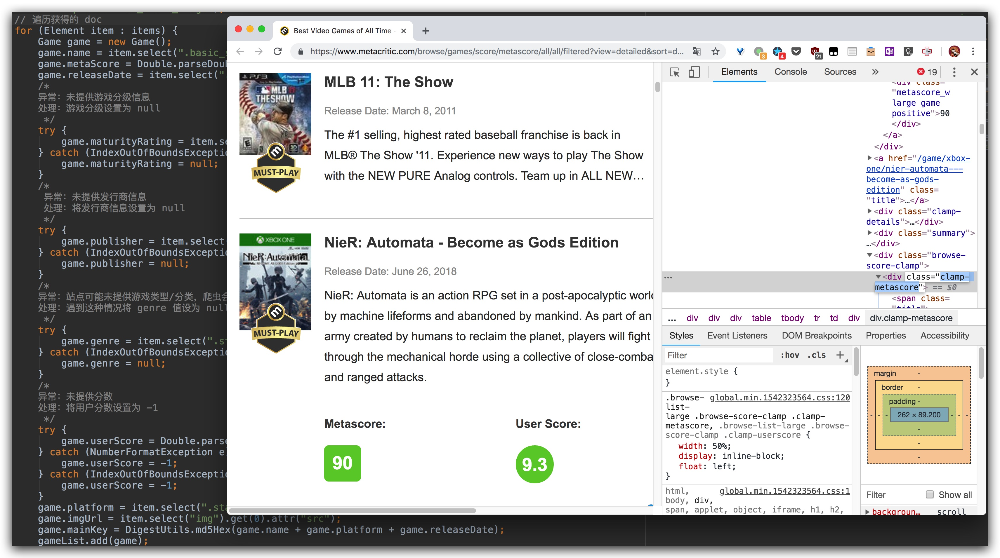
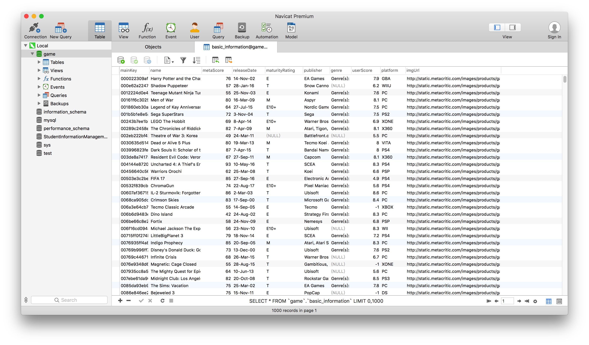

# Metacritic Crawler

A simple crawler collects the game information on [Metacritic](http://www.metacritic.com/game) implemented by Java.

Code: [GitHub](https://github.com/bolitao/Metacritic-Crawler)

Site: [Metacritic Crawler](https://bolitao.xyz/Metacritic-Crawler/)

Data: [basic_information.csv](https://raw.githubusercontent.com/bolitao/Metacritic-Crawler/master/result/basic_information.csv)

## Dev Environment

- JDK: 10.0.2
- lib: [jsoup](https://jsoup.org/), [mybatis](http://www.mybatis.org/mybatis-3/), [Codec](https://commons.apache.org/proper/commons-codec/)

## Screenshots

